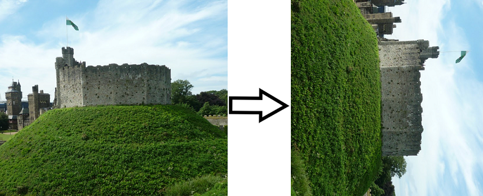
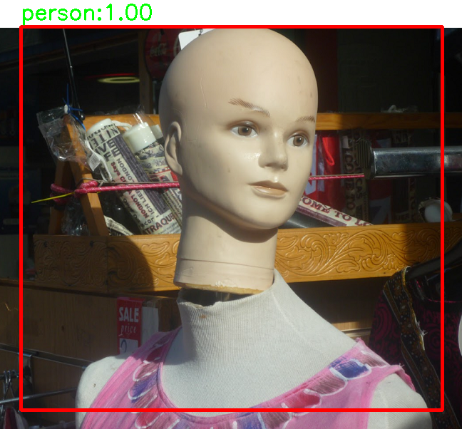
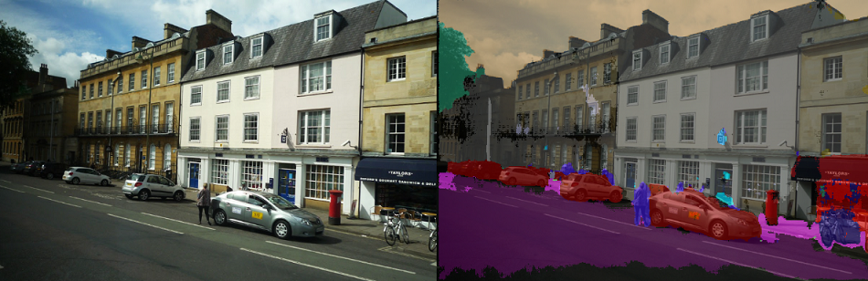
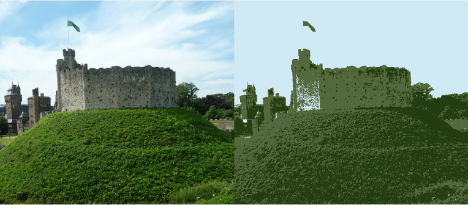

# OpenCV-tutorial

## セットアップ

ダウンロード
```
git clone --recursive git@github.com:textcunma/OpenCV-tutorial.git
```

仮想環境設定
```bash
conda env create -n study -f env.yml
```

## 内容


### 第1回：各種画像処理ライブラリの紹介とアフィン変換

- PIL
- Numpy
- OpenCV
- アフィン変換(回転,平行移動,拡大縮小)




### 第2回：YOLOv3を用いた物体検出

- OpenCV × YOLOv3
- 物体検出
- NMS




### 第3回：ENetを用いたセマンティックセグメンテーション

- OpenCV × ENet
- セマンティックセグメンテーション



### 第4回：クラスタリングを用いた減色・キー色処理

- OpenCV × k-means(k平均法)
- クラスタリング
- 減色処理
- キー色処理


